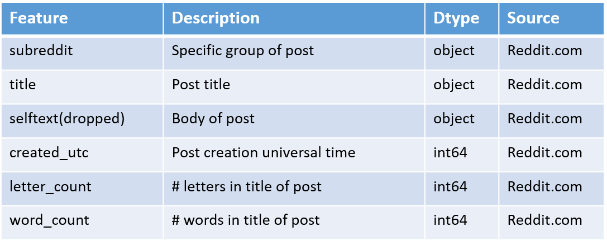
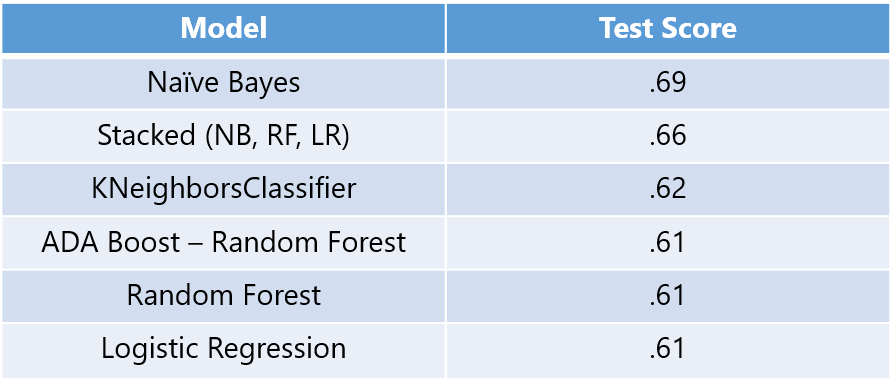
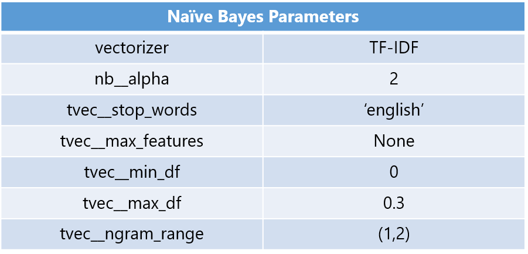

# Project 3: Subreddit and Political Parties

### Problem Statment
---
There has been great polarization in our American political system with often two completely different sets of news and facts being reported to people depending on their political affiliation.
We were asked to investigate whether we can determine a person’s political affiliation by the title posts on Reddit better than a random 50% baseline and also evaluate which words are most commonly used along party lines.

### Executive Summary
---
In this project we scrubbed posts from each political subreddit r/republican and r/democrats. Afterwards we parsed each of the titles to find commonalities and patterns in the words. We then ran multiple models to find the best model that most effectively predicts a republican or democratic post.

## 1. Subreddit information:

*2,000 posts from each subreddit, r/republican and r/democrats.
*Date range is from 11/13/22 to 1/9/23.
*subreddit and title columns were used for project.
    
## 2. Data Details:

## 3. Model Performance:

The following parameters were used to tune the top performing Naive Bayes model.

### Conclusion Next Steps
---

The Naive Bayes Model score of 69% was far higher than the 50% random baseline score so the model is effective in predicting the party affiliation of posts. The most commonly used words used in each of the political subreddits had anegative connotation. 

### Next Steps
---

Naive Bayes model was greatly overfit with a training score of 96%. Further adjusting and exploration is needed to reduce this high variance and make it come closer to the 69% training score. There are many overlapping words between the two subreddits and as a result the model may predict incorrectly. More tuning is needed to the model to include sentiment in prediction. For example to show a positive or negative connotation in the post in relation to a word. Also more in-depth analysis is needed to determine feature importance in order to find specific words that create higher liklihoods of being a democratic or republican post.